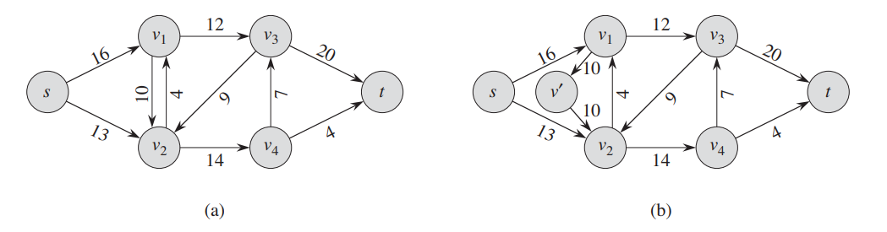
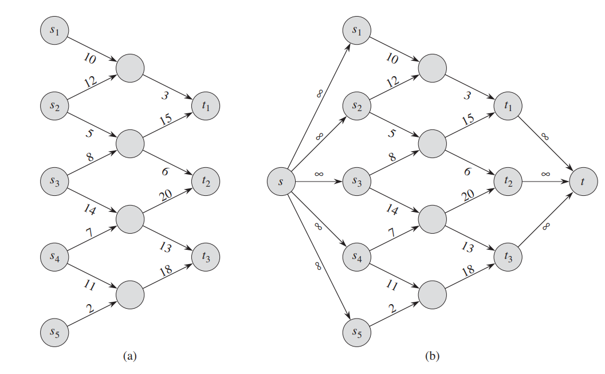
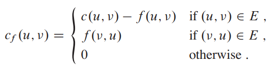
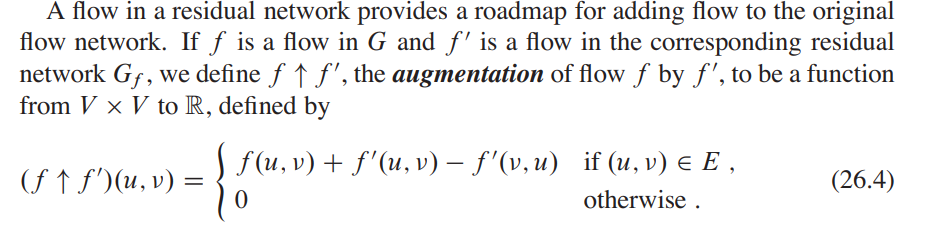
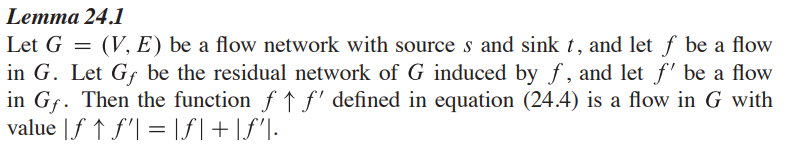
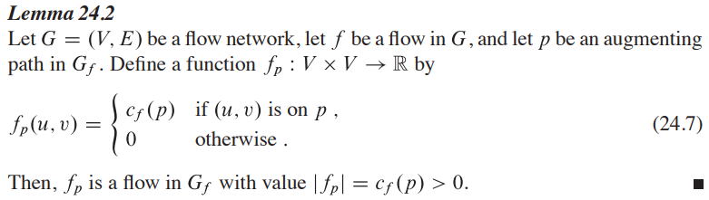
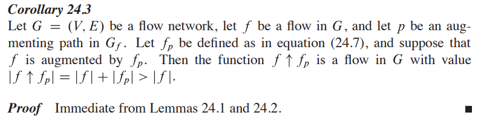
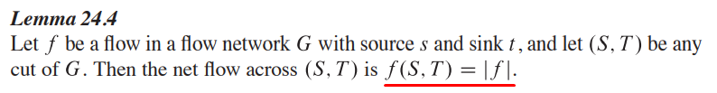
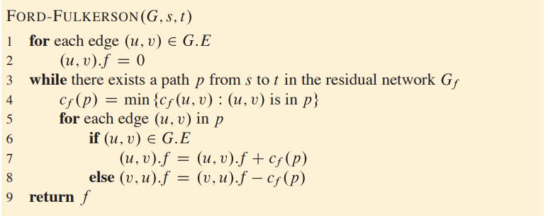

# Flujo Máximo

- El problema de flujo máximo consiste en obtener la cantidad de flujo máximo que podemos transportar desde el source al sink conservando el flujo de todos los vertices intermedios.
- **Conservación de flujo**: El flujo total que entra a un vertice tiene que ser igual al flujo total que sale del mismo. (Excepto soruce y sink).
- **flow network**: Un grafo dirigido sin ciclos $G = (V, E)$ donde todos los $(u,v) ∈ G.E$ tienen un capacidad $c(u, v) ≥ 0$. Y se distinguen 2 vertices: $s$ (source) y $t$ (sink). Las aristas que no estan en el grafo tienen costo 0. Y para cada vertice v del grafo, hay un camino de s a v y de v a t (grafo conectado, $| E| ≥ |V|$). (Tampoco se permiten self-loops).
- *Una restricción adicional*: si $(u,v) \in E, entonces (v, u) \notin E$. Si tenemos la arista de ida y quicieramos agregar la de la vuelta, podríamos agregar un vertice intermedio $v'$ talque $v → v'$ y $v'→ u$ ambas con el costo deseado.
{width=70%}

- **flujo**: Dado un grafo de flujo con función de capacidad $c$, soruce $s$ y sink $t$, se define el *flujo* como $f: V × V → ℝ$ (recibe una arista y devuelve un real), que satisface las restricciones de:
    - Capacidad: $0 ≤ f(u, v) ≤ c(u,v)$
    - Conservación: $\sum_{v ∈ V}f(v,u) = \sum_{v ∈ V}f(u,v)$. Para $(u,v) ∈ E, sino f(u,v) = 0$
- **Cantidad de flujo**: $|f| = \sum_{v ∈ V}f(s,v) - \sum_{v ∈ V}f(v,s)$, (el segundo término es 0). El problema de máximo flujo desea maximizar ésta cantidad.

- **Multiples sources y sinks**: Se quiere obtener el máximo flujo pero ahora se tiene un conjunto $\{s_{1},...,s_{m}\}$ de sources y un conjunto $\{t_{1},...,t_{n}\}$ de sinks. Se puede modelar el problema agregando un "supersource" $s$ conectado a todos los sources tq $c(s, s_{i}) = ∞$, y un "supersink" $t$ conectado a todos los sinks tq $c(t_{i}, t) = ∞$. Y el problema es equivalente a el de un source y un sink.

{width=75%}

## El Método de Ford-Fulkerson
- Se lo llama método ya que puede tener distintas implementaciones con distintas complejidades.
- Iterativamente incrementa el valor del flow. Se inicia con $f(u,v) = 0$ para todas las aristas, dando un valor de flujo inicial de 0. En cada iteración se busca un camino de aumento en el "grafo resudial" que nos permitirá saber que aristas aumentar y disminuir el flujo para aumentar el flujo total. Se repite hasta que en el grafo residual no haya más caminos de aumento.

```Python
Ford-Fulkerson-Method(G, s, t):
    initialize flow f to 0
    while there exists an augmenting path p in the residual network G_f
        augment flow f along p
    return f

```

### Grafos reciduales
- Dado un grafo G de flujo y f un flujo, el grafo residual $G_{f}$ consiste en los mismos vertices de G pero con aristas que representan los aumentos y decrementos posibles al flujo de las aristas de G. La diferencia es que si en G está la arista $(u, v)$, en $G_{f}$ también está la arista $(v, u)$. 
- **Capacidad residual**: definimos las capacidades de las aristas del grafo residual cómo:

{width=40%} 

  - Si  $(u, v) ∈ G.E$, la capacidad residual indica cuanto flujo más podemos enviar desde u hacia v (capacidad de la arista menos el flujo que pasa por dicha arista).
  - Si $(u, v) \notin  G.E$, entonces si $(v, u) ∈ G.E$ indica cuanto flujo podemos "devolver" de v hacia u. (que es justamente el flujo que hay en G de v hacia u).
  - Caso contrario en G se está enviando el maximo flujo posible o no hay arista de u a v ni v a u. 
  - $|E_{f}| \leq 2*|E|$

El flujo en el grafo recidual indica cómo cambiar el flujo en el grafo original para aumentar el flujo total.
Definimos el **aumento** de flujo de $f$ por $f'$ como:

{width=75%}

{width=75%}

### Aumentando caminos

- **Camino de aumento**: Dado un grafo de flujo $G=(V,E)$ y un flujo $f$, un camino de aumento es un camino de $s$ (source) a $t$ (sink) en el grafo recidual $G_{f}$.
- Llamamos a la máxima cantidad de flujo que podes aumentar en cada arista de un camino de aumento $p$, **capacidad residual** de p: $c_{f} = min\{c_{f}(u,v):(u,v) ∈ p\}$ 
- Podemos definir un flujo en base a la capacidad residual para poder usar el lema 24.1 y aumentar el flujo de $G$. Esto es, 0 si no pertenece al camino de aumento, y si sí pertenece el flujo vale la capacidad residual.
    
{width=75%}

Luego con el lema 24.1, podemos aumentar el flujo de G.

{width=75%}

### Cortes en grafo de flujos

- **Corte (S, T)**: Partición de $V$ en $S$ y $T$ (son disjuntos y su unión da V), tal que $s ∈ S$ y $t ∈ T$.
- **Flujo neto del corte**: Si $f$ es el flujo de $G = (V, E)$, entonces el flujo neto se define como:
  
  $\bf{f(S, T) = \sum_{u∈S}\sum_{v∈T} f(u,v) - \sum_{u∈S}\sum_{v∈T} f(v, u)}$. 
  
  (La suma del flujo que va desde S hacia T menos las que van de T hacia S).
- **Capacidad del corte**: $\bf{c(S,T) = \sum_{u∈S}\sum_{v∈T} c(u,v)}$.
- Un **corte mínimo** es aquel cuya capacidad es mínima entre todos los cortes posibles.
  
{width=75%}

- **Colorario 24.5**: El valor de cualquier flujo $f$ en $G$ está acotado por arriba por la capacidad de cualquier corte. En consecuencia, el valor del máximo flow está acotado por la capacidad del mínimo corte.

- **Teorema Max-flow Min-cut**: Sea $f$ un flujo en el grafo de flujo $G = (V, E)$ con source $s$ y sink $t$, las siguientes condiciones son equivalentes (una implica la otra):
    - $f$ es el flujo máximo de $G$.
    - El grafo residual $G_{f}$ no tiene ningun camino de aumento (de $s$ a $t$).
    - $|f| = c(S,T)$ para algún corte $(S,T)$ de $G$.  

### Algoritmo de Ford-Fulkerson
- Se empieza con un flujo 0 para todas las aristas.
- Se asume que para las aristas que no perteneces al grafo, tanto la capacidad y el flujo son 0 siempre.
- Iterativamente se busca un camino de aumento en el grafo residual y se calcula la capacidad residual del camino encontrado. Luego se actualizan los valores de las aristas tanto en el grafo original como en el residual. Termina cuando ya no hay caminos posibles de $s$ a $t$ en el grafo residual.
  
{width=75%}