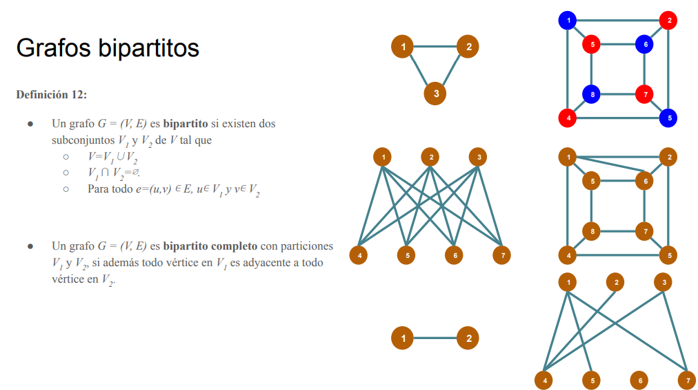
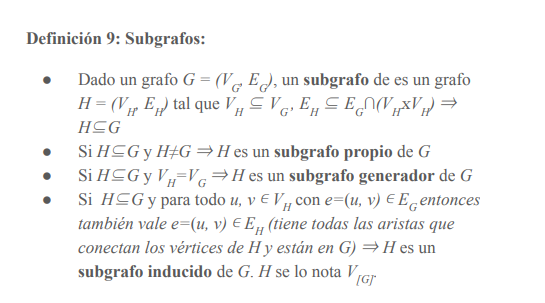
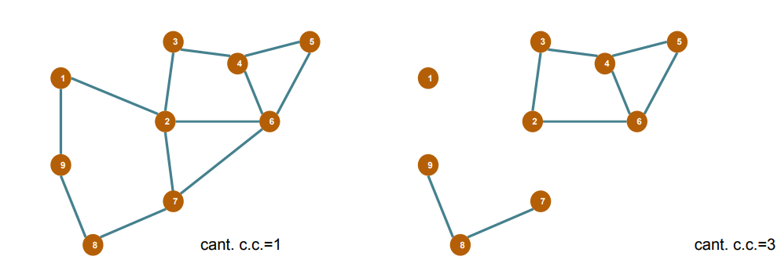
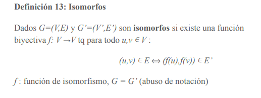
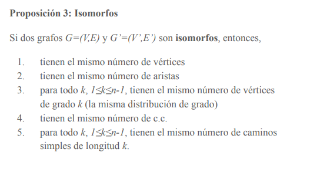
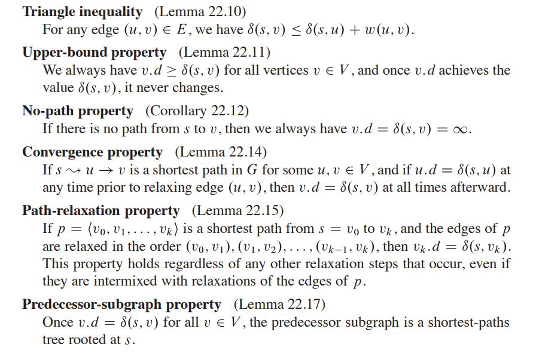
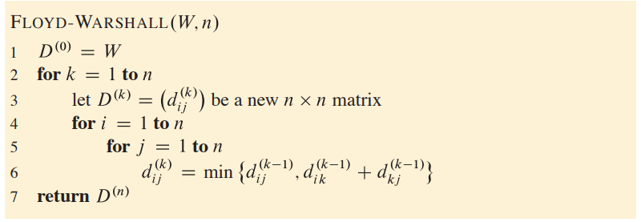
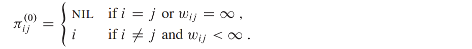
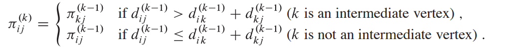

# Grafos
## Definiciones básicas
- Los **grafos** son un conjunto de vertices y ejes G = (V, E)
- si no aclara no tiene dirección
- No hay selfloops ni varios ejes para un mismo par de nodos (multigrafos)

### Tipos de grafos

- **Digrafo**: grafo con ejes con dirección (a lo sumo puede tener 2 ejes por par de nodos, uno para la ida y otro para la vuelta)
  - $d_{in}(v)$ : grado de entrada de un nodo
  - $d_{out}(v)$ : grado de salida de un nodo
  - las aristas E ahora son pares ordenados donde, sea e=(u, v), e se lo llama arco, u cola (desde donde viene) y v cabeza (hacia donde va)
- Dos grafos son isomorfismo si son iguales salvo por el nombre de los nodos (los rotas y quedan igual en distribución)
- **Grafos completos**: (para grafos sin dirección), todos los nodos estan conectados con todos
- **Grafo complemento**: Es el grafo con el mismo conjunto de vertices pero solo tiene las aristas que NO estan en G.
- **Grafo conexo**: (para grafos sin dirección) si existe un camino para todo par de vertices
- **Grafo fuertemente conexo**: (directed graphs) si existe un camino orientado entre todo par de vertices.
- **Grafos bipartitos**: es un grafo cuyos vértices se pueden separar en dos conjuntos disjuntos, de manera que las aristas no pueden relacionar vértices de un mismo conjunto.1 <br>


- **Grafos bipartitos completos**: es un grafo bipartito en que todos los vértices de uno de los subconjuntos están relacionados con los del otro subconjunto

- **subgrafos**:

{width=400px}

- **Componente conexa**: es un subgrafo conexo maximal (no está incluído estrictamente en otro grafo).

{width=400px}

- **Arboles**: 
  - Grafo conectado y aciclico
  - si saco una arista, se desconecta
  - si agrego una arista se forma un ciclo

### caminos y recorridos    
- **Vecindario**: N(v) es el conjunto de nodos de G adyacentes a v

- **grado**: d(v) = |N(v)| es la cantidad de vecinos
- **recorrido**: una secuencia de nodos conectados por aristas (pueden repetir nodos)
- **longitud de un recorrido**: la cantidad de *aristas* que tiene
- **Distancia** entre 2 nodos: el camino mas corto d(u,v). Si no existe es $∞$. La distancia de un vertice con si mismo es 0.
- **camino**: un recorrido sin nodos repetidos (tambien se llama camino simple cuando se refiere al recorrido como camino)
- **circuito**: un recorrido que empieza y termina en el mismo nodo
- **ciclo**: un circuito que no repite nodos (se puede decir ciclo al circuito y circuito simple al circuito)
- No es valido un ciclo de longitud 2
- **puente**: es una arista que al quitarla aumenta la cantidad de componentes conexas del grafo

### **Isomorfismo de grafos**:
{width=50%}
{width=50%}

## Teorema 1: suma de grados
$\sum _{v \in V}{d(v)}$ = $2m$

siendo m la cantidad de aristas del grafo

***colorario*** : la cantidad de nodos con grado impar es par. Esto debido a que la suma de todas las conexiones da un numero impar. Si sumamos 2 pares da par, si sumamos 2 impares de par, por lo que para preservar la paridad tiene que haber una cantidad par de nodos con grado impar. 

## DFS y BFS

### DFS sin stack

```c++
vector<vector<int>> aristas = ... ;
vector<bool> visitado(n, false);

void dfs(int v) {
  visitado[v] = true;

  for (int u : aristas[v]) {
    if (!visitado[u]) {
      dfs(u)
    }
  }

}
```

### DFS con stack
```c++
vector<vector<int>> aristas = ... ;
vector<bool> visitado(n, false);

void dfs(int v) {
  stack<int> s;
  s.push(v);
  vistados[v] = true

  while (!s.empty()) {
    int v = s.top(); s.pop();

    for (auto u: aristas[v]) {
      if (!visitado[u]) {
        visitado[u] = true;
        s.push(u);
      }
    }
    
  }

}

```

### BFS con cola


```c++
vector<vector<int>> aristas = ...;
vector<bool> visitados(n, false);
vector<int> distancia(n);

void bfs(int s) {
  visitados[s] = true
  distancia[s] = 0

  queue<int> q;
  q.push(s);

  while (!q.empty()) {
    int v = q.front(); q.pop();

    for (auto u : aristas[v]) {
      if (!visitado[u]) {
        visitado[u] = true;
        distancia[u] = distancia[v] +1;
        q.push(u);
      }
    }
  }
}
```

### Problemas que se resuelven con DFS y BFS

1. **¿Es el grafo conexo?**: Recorro con DFS o BFS desde algún nodo (el 0 por ejemplo) y si el vector de visitados no tiene ningún falso, entonces sí es conexo. De lo contrario hay nodos que desde el que comenzamos no podemos llegar. 
2. **¿Cuantas componentes conexas tengo?**: Cada vez que recorro el grafo desde un vertice, me marca como visitado los que pertenecen a su componente conexa. Luego me fijo cuales no fueron marcadas, recorro desde la primera no marcada para encotnrar todos los elementos de la otra componente conexa. Repito para obtener todas las componentes conexas.
```c++
int cant_comp_conexas = 0;
for (int i = 0; i < n; i++>) { // n la cantidad de vertices del grafo 
  if (!visitado[i]) {
    cant_comp_conexas++;
    recorro_desde_el_vertice(i); // con dfs o bfs
  } 
}
```

3. **¿Hay ciclos? Y si hay, guardame alguno**: Recorro el grafo y en cada paso guardo el padre del nodo actual. Recorro los vecinos del nodo actual v. Para cada vecino u, si no está recorrida le pongo el padre y la recorro, si está recorrida y no es el padre de v, entonces se hay un ciclo desde v hasta ese u    
```c++
vector<int> padres(n, -1);
vector<int> ciclo;
vector<vector<int>> aristas = ...;
int comienzo_ciclo = -1, fin_ciclo = -1;
queue<int> q;


for (int i = 0; i < n && comienzo_ciclo == fin_ciclo == -1; i++) {
  if (padre[i] == -1) {
    dfs_ciclos(i);
  }
}

if (comienzo_ciclo >= 0) {
  int v = comienzo_ciclo;
  ciclo.push_back(v);

  while (v != fin_ciclo) {
    v = padre[v];
    ciclo.push_back(v);
  }
}


void dfs_ciclos(int s) {
  padre[s] = 0;
  q.push(s);

  while (!q.empty() && comnienzo_ciclo == fin_ciclo == -1) {
    int v = q.top(); q.pop();

    for (auto u : aristas[v]) {
      if (padre[u] == -1) {
        padre[u] = v;
        q.push(u);
      } else if (u != padre[v]) {
        //si la arista no es la que apunta al padre de v, ciclo.
        comienzo_ciclo = v;
        fin_ciclo = u;
        break;
      }
    }
  }
}
```
4. **¿Es un grafo bipartito?**: Recorro el grafo pintando de 2 colores, cuando me encuentro en el recorrido uno del mismo color que su padre, entonces no es bipartito
```c++
void dfs_bipartito(int v) {
  for (int u : aristas[v]) {
    if (color[u] == -1) { 
      // si no esta pintado pinto
      color[u] = 1 - color[v];
      dfs(u);
    } else if (color[u] == color[v]) { 
      // si ya esta pintado chequeo
      es_bipartito = false;
    }
  }
}
// llamada
es_bipartito = true;
color[0] = 0;
dfs_bipartito(0);
```
5. **Cantidad de caminos desde w a v**: Luego de hacer BFS en w, tengo computadas todas las distancias desde w hacia cualquier nodo que tenga un camino con w. Luego para buscar la cantida de caminos, cuento la cantidad de caminos que hay desde los vecinos con distancia menor a v. Cuando la distancia es 0, estoy en el nodo w y hay un solo camino.
```c++
BFS(w)
cantidad_de_caminos_hasta(v);

int cantidad_de_caminos_hasta(v) {
  if (distancia[v] == 0) return 1;
  if (memo[v] != -1) return memo[v];
  int res = 0;

  for (int vecino : aristas[v]) {
    if (distancia[vecino] + 1 == distancia[v]) {
      res += cantidad_de_caminos_hasta(vecino);
    }
  }

  memo[v] = res;
  return res;
}

```
6. **Cantidad de puentes de un grafo**: Un puento es una arista que al quitarla aumenta la cantidad de componentes conexas del grafo<br>
En el recorrido DFS puedo tener 3 estados para cada vertice: Empecé a recorrer, terminé de recorrer, no lo recorrí. Según estos estados podemos clasificar a las aristas según el arbol generado por el DFS.<br>
Dado un momento del recorrido en un vertice V, vamos a ver todos sus vecinos. Si el vecino no lo recorrí, entonces la arista es un tree-edge (pertenece al arbol DFS). Si no, y si no es el padre, entonces es un back-edge (conecta con un ancestro) y no pertenece al arbol DFS. Una back-edge no es un puente <br>
Una arista es un puente si es un tree-edge y no tiene una back-edge "que la cubra". La cantidad de back-edges que cubre a una arista v de su padre es <br><br>
$\sum_{\text{w hijo de v}}{cubren(w)}$ $- backEdgesQueTerminanEn(v) + backEdgesQueEmpiezanEn(v)$ 
<br><br>
*backEdgesQueTerminanEn(v)*: aristas que no estan en el DFS que empiezan en algun decendiente de v y que terminan conectado en v.<br>
*backEdgesQueEmpiezanEn(v)*: aristas que empiezan en v y van hacia algun ancestro de v.<br>

- **Complejidad**: $O(n + m)$
```c++
vector<int> memo(n, -1);
int NO_LO_VI = 0, EMPECE_A_VER = 1, TERMINE_DE_VER = 2;
vector<int> estado(n, NO_LO_VI);
vector<vector<int>> tree_edges(n);
vector<int> back_edges_con_extremo_inferior_en(n), back_edges_con_extremo_superior_en(n);

void dfs_puentes(int v, int p = -1) {
  estado[v] = EMPECE_A_VER;
  for (int u : aristas[v]) {
    if (estado[u] == NO_LO_VI) {
      tree_edges[v].push_back(u);
      dfs_puentes(u, v);
    } else if (u != p) {
      if (estado[u] == EMPEZE_A_VER)      
        back_edges_con_extremo_inferior_en[v]++;
      else  // estado[u] == TERMINE_DE_VER
        back_edges_con_extremo_superior_en[v]++;
    }
  }
  estado[v] = TERMINE_DE_VER;
}

int cubren(int v, int p = -1) {
  if (memo[v] != -1) return memo[v];
  int res = 0;

  for (int hijo : tree_edges[v]) {
    if (hijo != p) {
      res += cubren(hijo, v);
    }
  }

  res -= back_edges_con_extremo_superior_en[v];
  res += back_edges_con_extremo_inferior_en[v];
  memo[v] = res;
  return res;
}

int componentes = 0, cant_puetnes = 0;

for (int i = 0; i < n; i++) {
  if (estado[i] != NO_LO_VI) {
    dfs_puentes(i);
    componentes++;
  }
}
for (int i = 0; i < n; i++) {
  if (cubren(i) == 0){
    cant_puentes++;
  }
}
// Por cada componente conexa hay una raiz que no lo cubre nadie,
// pero no cuenta para aristas puente
cant_puentes -= componentes

```
7. **Topological sort**: Dado un grafo acíclico dirigido G, es una ordenación lineal de todos los nodos de G que satisface que si G contiene la arista dirigida uv entonces el nodo u aparece antes del nodo v. En grafos con ciclos no hay orden topológico. (Se ordenan los nodos en orden de precedencia)
```c++
vector<lista<int>> aristas = ...;
vector<bool> visitado(bool, false)
vector<int> vertices_ordenados;
stack<int> res;

for (int i = 0; i < n; i++) {
  if (!visitado[i]) {
    dfs_topological_sort(i);
  }
}

for(int i = 0; i < n; i++) {
  vertices_ordenados.push_back(res.pop());
}

void dfs_topological_sort(int v) {
  visitado[v] = true;

  for (auto u : aristas[v]) {
    if (!visitado[u]) {
      dfs_topological_sort(u);
    }
  }
  res.push(v);

}
```
## Arboles
### Definiciones
- **Árbol**: T (grafo conexo sin circuitos simples)
- **Hoja**: u \ d(u) = 1 (un vertice con grado 1)
- **Raíz**: Algún vértice elegido
- **Bosque**: Conjunto de árboles (componentes conexas)
- **Árbol trivial**: T con n=1 y m=0

### Equivalencias (cada una implica la otra)
1. G es un árbol (grafo conexo sin circuitos simples).
2. G es un grafo sin circuitos simples y e una arista tq e $\notin$ E. G+e = (V, E+{e}) tiene exactamente un circuito simple, y ese circuito contiene a e. Es decir, si agrego una arista cualquiera se forma un ciclo.
3. $\exists$ exactamente un camino simple entre todo par de nodos. 
4. G es conexo, pero si se quita cualquier arista queda un grafo no conexo. Es decir, si saco cualquier arista se desconecta, o toda arista es puente

### Propiedades
- **Lema 1**: La unión entre dos caminos simples distintos entre u y v contiene
un circuito simple.
- **Lema 2**: Sea G = (V, E) un grafo conexo y e=(v,u) $\in$ E. <br>
G - e = (V, E \ {e}) es conexo $\iff$ e $\in$ C : circuito simple de G. <br>
( e=(v,u) $\in$ E es puente $\iff$ e no pertenece a un circuito simple de G ). 
- **Lema 3**: Todo árbol no trivial tiene al menos dos hojas.
- **Lema 4**: Sea G = (V, E) un árbol $⇒$ m = n - 1 (m = |E| n = |V|) (dem: inducción en n, sacas una hoja y la volves a poner)
- **Colorario 1**: Sea G un *bosque* con c c.c. $⇒$ m = n - c
- **Colorario 2**: Sea G un *grafo* con c c.c. $⇒$ m $≥$ n - c

### Mas equivalencias (teorema 2?)
1. G es un árbol (grafo conexo sin circuitos simples).
2. G es un grafo sin circuitos simples y m = n - 1
3. G es un grafo conexo y m = n - 1

## Árbol generador
**Un árbol generador** (AG) de un grafo G es un subgrafo que tiene
el mismo conjunto de vértices y es un árbol

Teorema 4:
1. Todo G conexo tiene al menos un AG.<br>
2. Si G conexo tiene un sólo AG entonces es un árbol.<br>
3. T=(V, $E_{T}$) es AG de G=(V, E). Sea e=E\ $E_{T}$ (no está en el árbol) tq T’ = T+e-f = (V, E $∪$ {e}\ {f}) con f una arista del único circuito que se forma al agregar e (de T+e ) $⇒$ T’ es otro AG de G.

## Árbol generador mínimo
Dado un grafo G=(V, E, w) con $w: E ⟶ R$ una función de costo para cada arista
- Costo del AGM T: $w(T) = ∑_{e ∈ E(T)} w(e)$ (la suma de los costos de las aristas del AGM)
- AGM es el AG para el cual $∑_{T}w$ es mínima.
- Para los grafos no pesados todo AG es AGM porque w=1 $⇒ ∑_{T}w=m=n-1$
- También puede haber varios AGM. Prim y Kruskal son 2 algoritmos para obtener AGMs

### Prim
- *Invariante*: tenemos un árbol de i aristas que es subgrafo de
algún AGM.<br>
*Inicialización*: empezamos con un solo vértice v arbitrario. <br>
*Iteración*: agregamos, de las aristas que podemos agregar y
seguir teniendo un arbol, la mas barata (Algoritmo goloso)

- **complejidad**: Hay implementaciones en $O(m*log(n)) y O(n²)$
```c++
vector<int> prim(int raiz, vector<lista<int>> ady) {
  vector<int> costo_vertices(n, inf);
  vector<int> padres_vertices(n, -1);
  vector<bool> elementos_en_cola(n, true);
  // los vertices se numeran de 1..n
  padres_vertices[raiz] = 0;
  costo_vertices[raiz] = 0;

  // encolo todos los elementos en un min heap,
  // cada elemento es un par <costo, elemento>
  min_heap<pair<int, int>> Q; // el algoritmo de heapify es lineal, O(V)
  for (int i = 1; i <= n; i++) {
    Q.insert(pair<int, int>(inf, i));
  }
  // O(V*log(V) + E*log(V)) por cada vertice, desencolo una vez, +, por cada arista 
  // (en el peor caso) hago un cambio en la cola de prioridad
  while (!Q.empty()) { 
    int w = Q.getMin(); Q.extractMin();
    elementos_en_cola[w] = false;

    for (auto v : ady[w]) {
      /* cuando agrego una arista al arbol generado en la iteración actual, 
       éste puede tener aristas hacia algún nodo que ya estaba en el arbol 
       pero con un costo menor.
       A--2--B    
         |   /
         4  1
         | /
         C
        Si empezamos en A, agregamos las aristas A-B y A-C. Luego en el tope de la cola
        queda B y vemos que tiene una arista B-C que tiene un coste menor que lo 
        computado hasta ahora (4 > 1), por lo que lo actualizamos y obtenemos el AGM con costo 3
      */
      if (elementos_en_cola[v] && costo_vertice(v) > costo(arista(w,v))) {
        costo_vertice[v] = costo(arista(w,v));
        padres_vertices[v] = w;
        Q.decreaseKey(pair<int,int>(costo_vertice[v], v));
      }
    }
  }
  return padres_vertices;
}
```
- **complejidad**: $O(V + V*log(V) + E*log(V)) = O(E*log(V)) = O(m*log(n))$. Si el grafo tiene una cantidad mayor o igual de aristas que de vertices y usando binary heap y lista de adyacencias. <br>
Se puede mejorar con fibonacci heap a $O(m + n*log(n))$. 
- **Implementación $O(n²)$**: consiste en hacer n veces buscar la arista (de las que todavia no se agregaron) con minimo costo a agregar. (la cátedra dió una implementación)

### Kruskal 
- Consiste en ordenar todas las aristas de menor a mayor según la función de w (peso o costo). Luego, inicialmente, todos los elementos forman su propia componente conexa y voy uniendolos recorriendo en orden de menor a mayor costo las aristas del grafo. Las agrego al bosque si no generan un ciclo, es decir si sus extremos no pertenecen a la misma cc.
  - *Invariante*: tenemos un bosque generador de i aristas que es
  subgrafo de alg´un AGM.
  - *Invariante alternativo*: tenemos un bosque generador de i
aristas que es mpiınimo entre los bosques de i aristas.
  - *Obs*: El primer invariante no implica al invariante
  alternativo. Pensar un ejemplo.
  - *Inicialización*: empezamos con todos los v´ertices y ninguna
  arista.
  - *Iteración*: agregamos, de las aristas que podemos agregar y
  seguir teniendo un bosque (no generan ciclos), la m´as barata
- **complejidad**: Hay implementaciones en $O(m*log(n))$ y $O(n²)$. La siguiente es $O(m*log(n))$
```c++
struct DSU {
    DSU(int n){
        padre = vector<int>(n);
        for(int v = 0; v < n; v++) padre[v] = v;
        tamano = vector<int>(n,1);
    }
    // dado un vértice me devuelve a qué componente conexa pertenece
    int find(int v){
        while(padre[v] != v) v = padre[v];
        return v;
    }
    // une las componentes conexas de u y v
    void unite(int u, int v){
        u = find(u); v = find(v);
        if(tamano[u] < tamano[v]) swap(u,v);
        //ahora u es al menos tan grande como v
        padre[v] = u;
        tamano[u] += tamano[v];
    }
 
    vector<int> padre;
    vector<int> tamano;
 
    //tamano[v] <= n
    //INV: si padre[v] != v entonces tamano[padre[v]] >= 2*tamano[v]
};
 
void kruskal(vector<tuple<int,int,int>>& E, int n){
    long long res = 0;
    sort(E.begin(),E.end());
    DSU dsu(n);
 
    int aristas = 0;
    for(auto [w,u,v] : E){
        //u y v estan en distinta cc?
        if(dsu.find(u) != dsu.find(v)){
            dsu.unite(u,v);
            res += w;
            aristas++;
        }
        if(aristas == n-1) break;
    }
    
    if(aristas == n-1) cout<<res<<'\n';
    else cout<<"IMPOSSIBLE\n";
}
 
int main(){
    int n,m;
    cin>>n>>m;
    vector<tuple<int,int,int>> E(m); //(costo,u,v)
    // lleno la lista de aristas y llamo a kruskal    
    kruskal(E,n);
    
    return 0;
}

```
## Para el parcial
- Según si el grafo es denso o raro conviene usar Prim o Kruskal. Aún así para los parciales pueden asumir que tienen un algoritmo mágico que resuelve AGM en $O(min( m*log(n), n²))$. También existen versiones de Prim y Kruskal para grafos ralos/densos

## Algoritmo de tarjan para puntos de articulación (o puentes)

Dado un grafo G = (V, E), un **punto de articulación** "v", es un vertice que tal que si lo removemos junto con sus aristas conectadas a él, el grafo se desconecta.

- Solución por fuerza bruta: ir sacando de a un vertice (y luego volver a ponerlo) y comprobar con DFS o BSF si el grafo siendo conexo. Costo $O(n * (n + m))$ 

### Algoritmo de tarjan para puntos de articulación

Se basa en DFS por lo que tiene costo $O(n+m)$. El algoritmo usa 4 arreglos: 
  - **visitado**: para tener un seguimiento de los vertices visitados
  - **momento_descubrimiento**: momento en el DFS llegó por primera vez al vertice (se tiene una variable global *tiempo* que por cada vertice visitado se incrementa en 1 y empieza en 0)
  - **mínimo_descubrimiento_alcanzable**: guarda para cada vertice, el mínimo tiempo de descubrimiento que se puede alcanzar desde el subarbol enraizado desde el vertice (tanto por tree edges como por backedges).
  - **padre**: para guardar cual es el padre de cada vertice en el recorrido. La raiz tiene padre "-1"

Se inicializan los 3 con largo igual a n y todos en -1. Se empieza el DFS desde un vertice cualquiera y por cada vertice "u" alcanzado:

* Se marca *u* como visitado, se setea su momento de descubrimiento y se aumenta la variable tiempo.
* Por cada vecino *v* de *u*:
  1. si *v* no está visitado, setear el padre de *v* como *u* y expandir el dfs hacia *v*. Cuando vuelva de la recursión de *v*, setear el minimo_momento_visita de *u* como el min(minimo_momento_visita[u], minimo_momento_visita[v])
  2. Si *u* no es la raiz y mínimo_descubrimiento_alcanzable[v] >= momento_descubrimiento[u] siginifica que desde el subarbol de v no hay ninguna arista que conecte con un ancestro de u (es decir, que tenga un momento de descubrimiento menor a u). Y por lo tanto *u* es un punto de articulación.
  3. Si *u* era la raiz y tiene al menos 2 hijos, entonces es un punto de articulación. 
 
 ```python
from collections import defaultdict

class Graph:
    def __init__(self, vertices):
        self.V = vertices
        self.graph = defaultdict(list)

    def add_edge(self, u, v):
        self.graph[u].append(v)
        self.graph[v].append(u)

    def dfs(self, u, visited, discovery_time, low, parent, time, articulation_points):
        visited[u] = True
        discovery_time[u] = time
        low[u] = time # mínimo_descubrimiento_alcanzable
        children = 0

        for v in self.graph[u]:
            if not visited[v]:
                parent[v] = u
                children += 1
                self.dfs(v, visited, discovery_time, low, parent, time + 1, articulation_points)

                low[u] = min(low[u], low[v])

                if parent[u] == -1 and children > 1:
                    articulation_points.add(u)
                elif parent[u] != -1 and low[v] >= discovery_time[u]:
                    articulation_points.add(u)
            elif v != parent[u]:
                low[u] = min(low[u], discovery_time[v])

    def find_articulation_points(self):
        visited = [False] * self.V
        discovery_time = [-1] * self.V
        low = [-1] * self.V
        parent = [-1] * self.V
        time = 0
        articulation_points = set()

        for u in range(self.V):
            if not visited[u]:
                self.dfs(u, visited, discovery_time, low, parent, time, articulation_points)

        return list(articulation_points)
 ```
### Algoritmo de tarjan para puentes

Es una idea similar a la anterior, dado un vertice *v* en el recorrido DFS, por cada vecino *u* nos fijamos que no haya una backedge en el subarbol de *u* que vaya a un ancestro de *v*. O lo que sería que si el subarbol *u* tiene un minimo_descubrimiento_alcanzable más grande que el momento de descubrimiento de *v* entonces la arista $(v,u)$ es un puente. 
- Complejidad: $O(n +m)$
```c++
int n; // number of nodes
vector<vector<int>> adj; // adjacency list of graph
vector<bool> visited;
vector<int> tin, low; // momento_descubrimiento, mínimo_descubrimiento_alcanzable 
int timer;

// p: padre (parent)
void dfs(int v, int p = -1) {
    visited[v] = true;
    tin[v] = low[v] = timer++;
    for (int to : adj[v]) {
        if (to == p) continue;
        if (visited[to]) {
            low[v] = min(low[v], tin[to]);
        } else {
            dfs(to, v);
            low[v] = min(low[v], low[to]);
            if (low[to] > tin[v])
                IS_BRIDGE(v, to);
        }
    }
}

void find_bridges() {
    timer = 0;
    visited.assign(n, false);
    tin.assign(n, -1);
    low.assign(n, -1);
    for (int i = 0; i < n; ++i) {
        if (!visited[i])
            dfs(i);
    }
}
```

## Propiedades útiles sacadas de las guias 2 y 3
### Guia 2
- **Ej 5**: Sean P y Q dos caminos distintos de un grafo G que unen un vértice v con otro w, G tiene un ciclo cuyas aristas pertenecen a P o Q.

- **Ej 6**: G un grafo conexo, todo par de caminos simples de longitud máxima de G tiene un vertice en común

- **Ej 10**: Sea G un grafo de n vértices. G − v es bipartito para todo v $∈$ V (G) si y solo si G es bipartito o un ciclo impar

- **Ej 14**:<br> 
Si todos los vértices de un digrafo D tienen
grado de salida mayor a 0, entonces D tiene un ciclo. <br>
Un digrafo D es acíclico si y solo si D es trivial o D tiene un vértice con $d_{out}(v) = 0$ tal que D \ {v} es acíclico

- **Ej 15**: $O(\sum_{v\in V(G)} d(v)) = O(m)$. Todo grafo tiene $O(\sqrt{m})$ vértices con grado al menos $\sqrt{m}$.

### Guia 3
- **Ej 2**: Una arista de un grafo G es puente si su remoción aumenta la cantidad de componentes conexas. Sea T un árbol DFS de un grafo conexo G, vw es un puente de G si y solo si vw no pertenece a ningún ciclo de G. <br>
Si vw $∈$ E(G) \ E(T), entonces v es un ancestro de w en T o viceversa <br>
Sea vw $∈$ E(G) una arista tal que el nivel de v en T es menor o igual al nivel de w en T, vw es puente si y solo si v es el padre de w en T y ninguna arista de G\ {vw} une a un descendiente de w (o a w) con un ancestro de v (o con v).

- **Ej 5**: Un árbol generador T de un grafo G es v-geodésico si la distancia entre v y w en T es igual a la distancia entre v y w en G para todo w $∈$ V (G). Todo árbol BFS de G enraizado en v es v-geodésico. La vuelta no vale, no todo árbol generador v-geodésico de un grafo G pueda ser generado con BFS sobre G desde v.

- **Ej 13**: Sea G un digrafo, si los pesos de G son todos distintos, entonces G tiene un único árbol generador mínimo.

## Camino mínimo para grafos con peso y dirección
Dado un grafo $G = (V, E)$ y su función de pesos $w : E →  ℝ$, el **peso de un camino** $w(p)$ para $p = ( v_{0}, ..., v_{k} )$ es la suma de los pesos de cada arista: $\sum_{i=1}^{k} w(v_{i-1}, v_{i})$. $\\$
Definimos el camíno más corto de $v$ a $u$ como

$δ(u, v) = min\{w(p): u →^{p} v\}$ si existe un camino de u a v $\\$
$δ(u, v) = ∞$ en caso contrario

Además si el grafo tiene ciclos negativos (por tener aristas con costo negativo) tal que un camino de $v$ a $u$ contiene un ciclo negativo, entonces el camino más corto de $v$ a $u$ no se puede definir y decimos que tiene costo $-∞$.

También podemos decir que el camino más corto entre $u$ y $v$ no tiene ciclos de costo positivo (o 0), porque si los tuviera los podríamos sacar y obtendriamos un camino con un costo menor o igual.
Vamos a asumir que cuando se dice caminos más cortos son caminos simples (sin ciclos).

### Lema 22.1 (cormen)
Dado un grafo G dirigido y con peso, los subcaminos de un camino mínimo entre un vertice $v$ y $u$ también son caminos mínimos.

## Algoritmos de camino minimo para grafos con peso y dirección
Los algoritmos producen tanto el minimo costo para llegar desde un vertice $s$ a cualquier vertice alcanzable $v ∈ V$ cómo el camino en sí. Y como no tiene ciclos, es un arbol. Se lo llama *arbol de camino mínimo*.$\\$
Cada vertice guarda a su predecesor $v.π$ y un estimado del costo del camino mínimo $v.d$. Todos los algoritmos inicializan a $s.d=0, s.π = NIL$,  $v.π = NIL, v.d = ∞$ para todo $v ∈ V - \{s\}. \\$
Luego iterativamente se va recorriendo las aristas "*relajandolas*", esto es chequear para una arista $vu$ si 
$v.d > v.u + w(u,v)$. Si esto se cumple el camino de $s$ a $u$ y la arista $uv$ es más corto que el camino más corto de $s$ a $v$ computado hasta ahora. Se actualiza $v.d$ y $v.π \\$
Una vez terminado, cada vertice del arbol tiene el mínimo costo y si se va iterando por los predecesores, se puede obtener.

### Propiedades del camino más corto y relajación
{width=70%}


### Algoritmo de Bellman-Ford, Single-Source (con ciclos)
- **Complejidad**: $O(V^2+VE)$
- Dado un grafo $G$ dirigido y con peso, y una arista fuente "s", sí $G$ no tiene ciclos negativos el algoritmo devuelve TRUE y un arbol de costo mínimo tal que cada vertice alcanzable desde "s" guarda su padre y el costo mínimo de llegar a él desde "s". Si hay un ciclo negativo, devuelve FALSE. 

```python
BELLMAN-FORD(G, w, s)
  INITIALIZE-SINGLE-SOURCE(G, s)
  for i = 1 to |G.V| - 1
    for each edge (u, v) ∈ G.E
      RELAX(u, v, w)
  for each edge (u, v) ∈ G.E
    if v.d > u.d + w(u, v)
      return FALSE
  return TRUE

RELAX(u, v, w)
  if v.d > u.d + w(u, v):
    v.d = u.d + w(u, v)
    v.π = u

INITIALIZE-SINGLE-SOURCE(G, s)
  for each vertex v ∈ G.V
    v.d = ∞
    d.π = NIL
  s.d = 0
```

### Single-Source (sin ciclos)
Si ponemos la restricción de que el grafo dirigido con peso $G$ sea aciclico (DAG), podemos hacer un algoritmo de camino más corto con costo **$ϴ(V + E)$** usando topological sort (que tiene ese mismo costo). $\\$
Al terminar el algoritmo produce el arbol de costo mínimo tal que cada vertice guarda el costo mínimo del camino hasta el source y su padre.

```python
DAG-SHORTEST-PATHS(G, w, s)
  topological_sort(G)
  INITIALIZE-SINGLE-SOURCE(G, s)

  for each vertex u ∈ G.V, taken in topological sort:
    for each vertex v in G.ady[u]:
      RELAX(u, v, w)
```

### Algoritmo de Dijkstra, Single-Source  (sin pesos negativos)
El algoritmo mantiene un conjunto $S$ de los vertices que ya tienen el camino más corto hacia $s$ calculado. Iterativamente toma el vertice $u ∈ V-S$ con el mínimo camino más corto estimado hasta el momento. Se agrega $u$ a $S$ y se relajan todas las aristas que salen de $u. \\$
El algoritmo de Dijkstra ejecutado sobre un grafo G con aristas no negativas y source $s$ produce un subgrafo de predecesores $G_{π}$ que es un arbol de caminos más cortos enraizado en $s$. 

- **Complejidad**: Depende de la implementación del min-heap. 
  - Si es un arreglo (aprovechando que los vertices se numeran de 1 a $|V|$-1) donde en cada posición se guarda el $v.d$, Insert y Decrease-key cuestan $O(1)$ y Extract-Min $O(V)$. Se hacen $O(V)$ Extract-Min y $O(E)$ Inserts y Decrease-keys. Queda $\bf{O(V^2 + E) = O(V^2)}$
  - Podemos usar un binary-heap. Extract-Min con costo $O(lgV)$ y se hace |V| veces; construir el heap cuesta $O(V)$ (heapify); Decrease-key tiene costo $O(lgV)$ y se hace |E| veces. Queda un costo de $\bf O{((V+E)\ lgV)}$ que en general (para grafos con más aristas que vértices) queda $\bf{O(E\ lgV)}$. Si se cumple que E = $o(V^2 / lgV)$ entonces éste es una implementación mejor. 
  - Con un fibonacci heap queda $\bf{O(VlgV+E)}$

```python
DIJKSTRA(G, w, s)
  INITIALIZE-SINGLE-SOURCE(G, s)
  S = Ø
  Q = Ø # min-heap

  for each vertex u ∈ G.V
    Insert(Q, u)

  while Q ≠ Ø
    u = Extract-Min(Q)
    S = Union(S, {u})
    for each vertex v in G.adj[u]
      RELAX(u, v, w)
      if relax decreased v.d
        Decrease-Key(Q, v, v.d)

```

### Algoritmo de Floyd-Warshall para todos a todos (sin ciclos negativos)
Se basa en la representación de grafos con matriz de adyacencia.

{width=70%}

- W: la matriz de costos
- $D^{0}$: la matriz de costos mínimos para los caminos con ningun vertice intermedio.
- $D^{k}$: la matriz de costos mínimos para los caminos con {1,2,...,k} vertices intermedios.
- $d_{ij}^{k}$: representa el costo del camino mínimo de i a j con los {1,2,...,k} vertices como intermedios.
- $n$: la cantidad de vertices
- **Complejidad**: $θ(V^3)$

**Idea del algoritmo**: Se numeran los vertices del grafo como {1,2,...,n}. En cada paso $k$ se busca el costo del camino mínimo que usa de intermedios a los vertices del subconunto {1,2,..,k} de vertices. Con k = 0 corresponde a los caminos sin vertices intermedios, entonces solo tenemos los costos de las aristas que conectan directamente a i con j (es decir, los pesos de las aristas).

Luego para k > 0 vemos el mínimo costo de los caminos de i a j tal que se usen los vertices {1,...,k} en dichos caminos. Puede pasar que k pertenesca al camino mínimo mejor que el computado hasta ahora sin k (con los vertices intermedios de {1,...,k-1}), por lo que el costo del camino mínimo desde i a k más el de k a j (ambos subcaminos no usan a k) es menor que el camíno mínimo computado de i a j sin usar k de intermedio.

En sintesis la semantica de la recursión es: $\bf d^{k}_{ij}$ el minimo costo del camino de i a j usando los vertices {1,..,k} es el mínimo entre $\bf d^{k-1}_{ij}$ el mínimo costo del camino de i a j con los vertices {1,...,k-1} de intermedios (sin usar a k), y $\bf d^{k-1}_{ik} + d^{k-1}_{kj}$ el mínimo costo del camino de i a j usando de intermedio a los vertices {1,...,k-1} y tambien a k (para calcular esto, vemos el minimo camino desde i a k y desde k a j usando los vertices {1,...,k-1}).

#### Agregando la matriz de predecesores

Se define la matriz de predecesores $∏$ como aquella con elementos $π_{ij}$ que contienen el predecesor de j para el camino mínimo de i a j. Si i = j o no hay camino posible, $π_{ij}$ = NIL. $\\$
Es decir, para recuperar el camíno mínimo desde i hacia j hay que iterar sobre los antecesores de j empezando por $π_{ij}$ hasta llegar a $π_{ii}$ = NIL.

Se puede ir computando la matriz de predecesores $∏^{0}, ∏^{1},..., ∏^{k}$ para los disintos k pasos del algoritmo de floyd. (k = n es el resultado del problema). Formulación recursiva para cada paso de k:

**Para k = 0**:

{width=60%} 

**Para k > 0**:

{width=60%} 
Si el camino usando k de intermedio es mejor, entonces hay que usar el predecesor dado por el camino de k a j.