## Camino mínimo para grafos con peso y dirección
Dado un grafo $G = (V, E)$ y su función de pesos $w : E →  ℝ$, el **peso de un camino** $w(p)$ para $p = ( v_{0}, ..., v_{k} )$ es la suma de los pesos de cada arista: $\sum_{i=1}^{k} w(v_{i-1}, v_{i})$. $\\$
Definimos el camíno más corto de $v$ a $u$ como

$δ(u, v) = min\{w(p): u →^{p} v\}$ si existe un camino de u a v $\\$
$δ(u, v) = ∞$ en caso contrario

Además si el grafo tiene ciclos negativos (por tener aristas con costo negativo) tal que un camino de $v$ a $u$ contiene un ciclo negativo, entonces el camino más corto de $v$ a $u$ no se puede definir y decimos que tiene costo $-∞$.

También podemos decir que el camino más corto entre $u$ y $v$ no tiene ciclos de costo positivo (o 0), porque si los tuviera los podríamos sacar y obtendriamos un camino con un costo menor o igual.
Vamos a asumir que cuando se dice caminos más cortos son caminos simples (sin ciclos).

### Lema 22.1 (cormen)
Dado un grafo G dirigido y con peso, los subcaminos de un camino mínimo entre un vertice $v$ y $u$ también son caminos mínimos.

## Algoritmos de camino minimo para grafos con peso y dirección
Los algoritmos producen tanto el minimo costo para llegar desde un vertice $s$ a cualquier vertice alcanzable $v ∈ V$ cómo el camino en sí. Y como no tiene ciclos, es un arbol. Se lo llama *arbol de camino mínimo*.$\\$
Cada vertice guarda a su predecesor $v.π$ y un estimado del costo del camino mínimo $v.d$. Todos los algoritmos inicializan a $s.d=0, s.π = NIL$,  $v.π = NIL, v.d = ∞$ para todo $v ∈ V - \{s\}. \\$
Luego iterativamente se va recorriendo las aristas "*relajandolas*", esto es chequear para una arista $vu$ si 
$v.d > v.u + w(u,v)$. Si esto se cumple el camino de $s$ a $u$ y la arista $uv$ es más corto que el camino más corto de $s$ a $v$ computado hasta ahora. Se actualiza $v.d$ y $v.π \\$
Una vez terminado, cada vertice del arbol tiene el mínimo costo y si se va iterando por los predecesores, se puede obtener.

### Propiedades del camino más corto y relajación
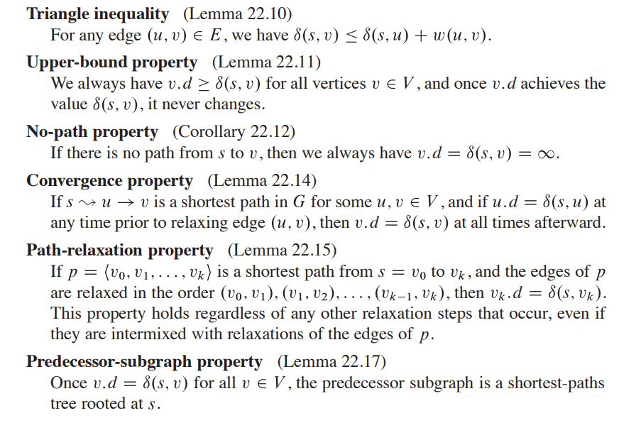{width=70%}


### Algoritmo de Bellman-Ford, Single-Source (puede tener pesos negativos)
- **Complejidad**: $O(V^2+VE)$
- Dado un grafo $G$ dirigido y con peso, y una arista fuente "s", sí $G$ no tiene ciclos negativos el algoritmo devuelve TRUE y un arbol de costo mínimo tal que cada vertice alcanzable desde "s" guarda su padre y el costo mínimo de llegar a él desde "s". Si hay un ciclo negativo, devuelve FALSE. 

```python
BELLMAN-FORD(G, w, s)
  INITIALIZE-SINGLE-SOURCE(G, s)
  for i = 1 to |G.V| - 1
    for each edge (u, v) ∈ G.E
      RELAX(u, v, w)
  for each edge (u, v) ∈ G.E
    if v.d > u.d + w(u, v)
      return FALSE
  return TRUE

RELAX(u, v, w)
  if v.d > u.d + w(u, v):
    v.d = u.d + w(u, v)
    v.π = u

INITIALIZE-SINGLE-SOURCE(G, s)
  for each vertex v ∈ G.V
    v.d = ∞
    d.π = NIL
  s.d = 0
```

### Single-Source (sin ciclos)
Si ponemos la restricción de que el grafo dirigido con peso $G$ sea aciclico (DAG), podemos hacer un algoritmo de camino más corto con costo **$ϴ(V + E)$** usando topological sort (que tiene ese mismo costo). $\\$
Al terminar el algoritmo produce el arbol de costo mínimo tal que cada vertice guarda el costo mínimo del camino hasta el source y su padre.

```python
DAG-SHORTEST-PATHS(G, w, s)
  topological_sort(G)
  INITIALIZE-SINGLE-SOURCE(G, s)

  for each vertex u ∈ G.V, taken in topological sort:
    for each vertex v in G.ady[u]:
      RELAX(u, v, w)
```

### Algoritmo de Dijkstra, Single-Source  (sin pesos negativos)
El algoritmo mantiene un conjunto $S$ de los vertices que ya tienen el camino más corto hacia $s$ calculado. Iterativamente toma el vertice $u ∈ V-S$ con el mínimo camino más corto estimado hasta el momento. Se agrega $u$ a $S$ y se relajan todas las aristas que salen de $u. \\$
El algoritmo de Dijkstra ejecutado sobre un grafo G con aristas no negativas y source $s$ produce un subgrafo de predecesores $G_{π}$ que es un arbol de caminos más cortos enraizado en $s$. 

- **Complejidad**: Depende de la implementación del min-heap. 
  - Si es un arreglo (aprovechando que los vertices se numeran de 1 a $|V|$-1) donde en cada posición se guarda el $v.d$, Insert y Decrease-key cuestan $O(1)$ y Extract-Min $O(V)$. Se hacen $O(V)$ Extract-Min y $O(E)$ Inserts y Decrease-keys. Queda $\bf{O(V^2 + E) = O(V^2)}$
  - Podemos usar un binary-heap. Extract-Min con costo $O(lgV)$ y se hace |V| veces; construir el heap cuesta $O(V)$ (heapify); Decrease-key tiene costo $O(lgV)$ y se hace |E| veces. Queda un costo de $\bf O{((V+E)\ lgV)}$ que en general (para grafos con más aristas que vértices) queda $\bf{O(E\ lgV)}$. Si se cumple que E = $o(V^2 / lgV)$ entonces éste es una implementación mejor. 
  - Con un fibonacci heap queda $\bf{O(VlgV+E)}$

```python
DIJKSTRA(G, w, s)
  INITIALIZE-SINGLE-SOURCE(G, s)
  S = Ø
  Q = Ø # min-heap

  for each vertex u ∈ G.V
    Insert(Q, u)

  while Q ≠ Ø
    u = Extract-Min(Q)
    S = Union(S, {u})
    for each vertex v in G.adj[u]
      RELAX(u, v, w)
      if relax decreased v.d
        Decrease-Key(Q, v, v.d)

```

### Algoritmo de Floyd-Warshall para todos a todos (puede tener pesos negativos)
Se basa en la representación de grafos con matriz de adyacencia.

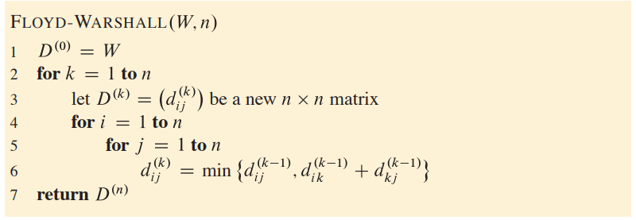{width=70%}

- W: la matriz de costos
- $D^{0}$: la matriz de costos mínimos para los caminos con ningun vertice intermedio.
- $D^{k}$: la matriz de costos mínimos para los caminos con {1,2,...,k} vertices intermedios.
- $d_{ij}^{k}$: representa el costo del camino mínimo de i a j con los {1,2,...,k} vertices como intermedios.
- $n$: la cantidad de vertices
- **Complejidad**: $θ(V^3)$

**Idea del algoritmo**: Se numeran los vertices del grafo como {1,2,...,n}. En cada paso $k$ se busca el costo del camino mínimo que usa de intermedios a los vertices del subconunto {1,2,..,k} de vertices. Con k = 0 corresponde a los caminos sin vertices intermedios, entonces solo tenemos los costos de las aristas que conectan directamente a i con j (es decir, los pesos de las aristas).

Luego para k > 0 vemos el mínimo costo de los caminos de i a j tal que se usen los vertices {1,...,k} en dichos caminos. Puede pasar que k pertenesca al camino mínimo mejor que el computado hasta ahora sin k (con los vertices intermedios de {1,...,k-1}), por lo que el costo del camino mínimo desde i a k más el de k a j (ambos subcaminos no usan a k) es menor que el camíno mínimo computado de i a j sin usar k de intermedio.

En sintesis la semantica de la recursión es: $\bf d^{k}_{ij}$ el minimo costo del camino de i a j usando los vertices {1,..,k} es el mínimo entre $\bf d^{k-1}_{ij}$ el mínimo costo del camino de i a j con los vertices {1,...,k-1} de intermedios (sin usar a k), y $\bf d^{k-1}_{ik} + d^{k-1}_{kj}$ el mínimo costo del camino de i a j usando de intermedio a los vertices {1,...,k-1} y tambien a k (para calcular esto, vemos el minimo camino desde i a k y desde k a j usando los vertices {1,...,k-1}).

#### Agregando la matriz de predecesores

Se define la matriz de predecesores $∏$ como aquella con elementos $π_{ij}$ que contienen el predecesor de j para el camino mínimo de i a j. Si i = j o no hay camino posible, $π_{ij}$ = NIL. $\\$
Es decir, para recuperar el camíno mínimo desde i hacia j hay que iterar sobre los antecesores de j empezando por $π_{ij}$ hasta llegar a $π_{ii}$ = NIL.

Se puede ir computando la matriz de predecesores $∏^{0}, ∏^{1},..., ∏^{k}$ para los disintos k pasos del algoritmo de floyd. (k = n es el resultado del problema). Formulación recursiva para cada paso de k:

**Para k = 0**:

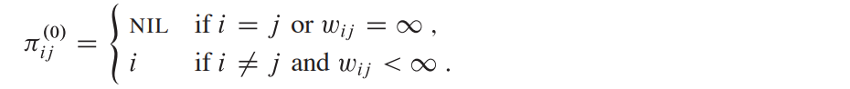{width=60%} 

**Para k > 0**:

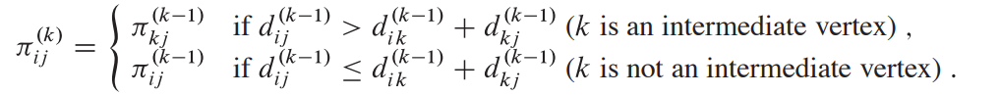{width=60%} 

Si el camino usando k de intermedio es mejor, entonces hay que usar el predecesor dado por el camino de k a j.

# Flujo Máximo

- El problema de flujo máximo consiste en obtener la cantidad de flujo máximo que podemos transportar desde el source al sink conservando el flujo de todos los vertices intermedios.
- **Conservación de flujo**: El flujo total que entra a un vertice tiene que ser igual al flujo total que sale del mismo. (Excepto soruce y sink).
- **flow network**: Un grafo dirigido sin ciclos $G = (V, E)$ donde todos los $(u,v) ∈ G.E$ tienen un capacidad $c(u, v) ≥ 0$. Y se distinguen 2 vertices: $s$ (source) y $t$ (sink). Las aristas que no estan en el grafo tienen costo 0. Y para cada vertice v del grafo, hay un camino de s a v y de v a t (grafo conectado, $| E| ≥ |V|$). (Tampoco se permiten self-loops).
- *Una restricción adicional*: si $(u,v) \in E, entonces (v, u) \notin E$. Si tenemos la arista de ida y quicieramos agregar la de la vuelta, podríamos agregar un vertice intermedio $v'$ talque $v → v'$ y $v'→ u$ ambas con el costo deseado.
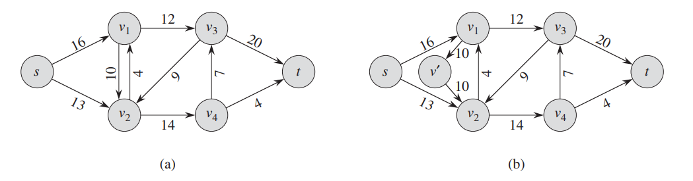{width=70%}

- **flujo**: Dado un grafo de flujo con función de capacidad $c$, soruce $s$ y sink $t$, se define el *flujo* como $f: V × V → ℝ$ (recibe una arista y devuelve un real), que satisface las restricciones de:
    - Capacidad: $0 ≤ f(u, v) ≤ c(u,v)$
    - Conservación: $\sum_{v ∈ V}f(v,u) = \sum_{v ∈ V}f(u,v)$. Para $(u,v) ∈ E, sino f(u,v) = 0$
- **Cantidad de flujo**: $|f| = \sum_{v ∈ V}f(s,v) - \sum_{v ∈ V}f(v,s)$, (el segundo término es 0). El problema de máximo flujo desea maximizar ésta cantidad.

- **Multiples sources y sinks**: Se quiere obtener el máximo flujo pero ahora se tiene un conjunto $\{s_{1},...,s_{m}\}$ de sources y un conjunto $\{t_{1},...,t_{n}\}$ de sinks. Se puede modelar el problema agregando un "supersource" $s$ conectado a todos los sources tq $c(s, s_{i}) = ∞$, y un "supersink" $t$ conectado a todos los sinks tq $c(t_{i}, t) = ∞$. Y el problema es equivalente a el de un source y un sink.

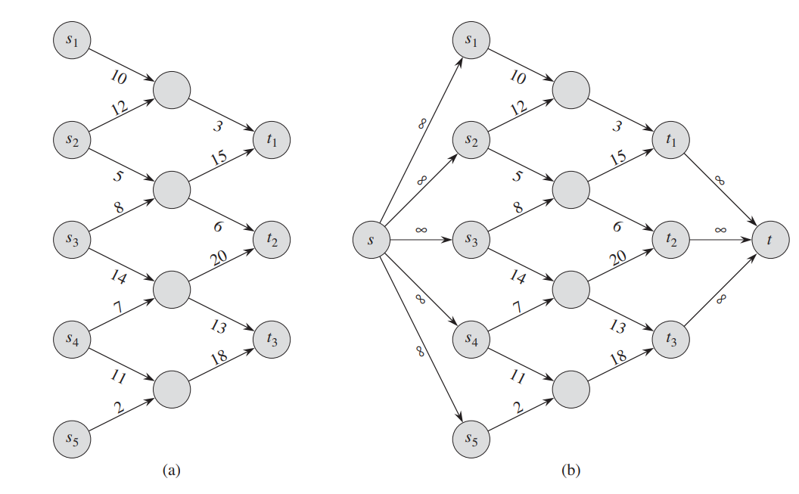{width=75%}

## El Método de Ford-Fulkerson
- Se lo llama método ya que puede tener distintas implementaciones con distintas complejidades.
- Iterativamente incrementa el valor del flow. Se inicia con $f(u,v) = 0$ para todas las aristas, dando un valor de flujo inicial de 0. En cada iteración se busca un camino de aumento en el "grafo resudial" que nos permitirá saber que aristas aumentar y disminuir el flujo para aumentar el flujo total. Se repite hasta que en el grafo residual no haya más caminos de aumento.

```Python
Ford-Fulkerson-Method(G, s, t):
    initialize flow f to 0
    while there exists an augmenting path p in the residual network G_f
        augment flow f along p
    return f

```

### Grafos reciduales
- Dado un grafo G de flujo y f un flujo, el grafo residual $G_{f}$ consiste en los mismos vertices de G pero con aristas que representan los aumentos y decrementos posibles al flujo de las aristas de G. La diferencia es que si en G está la arista $(u, v)$, en $G_{f}$ también está la arista $(v, u)$. 
- **Capacidad residual**: definimos las capacidades de las aristas del grafo residual cómo:

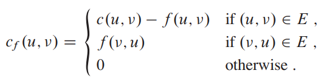{width=40%} 

  - Si  $(u, v) ∈ G.E$, la capacidad residual indica cuanto flujo más podemos enviar desde u hacia v (capacidad de la arista menos el flujo que pasa por dicha arista).
  - Si $(u, v) \notin  G.E$, entonces si $(v, u) ∈ G.E$ indica cuanto flujo podemos "devolver" de v hacia u. (que es justamente el flujo que hay en G de v hacia u).
  - Caso contrario en G se está enviando el maximo flujo posible o no hay arista de u a v ni v a u. 
  - $|E_{f}| \leq 2*|E|$

El flujo en el grafo recidual indica cómo cambiar el flujo en el grafo original para aumentar el flujo total.
Definimos el **aumento** de flujo de $f$ por $f'$ como:

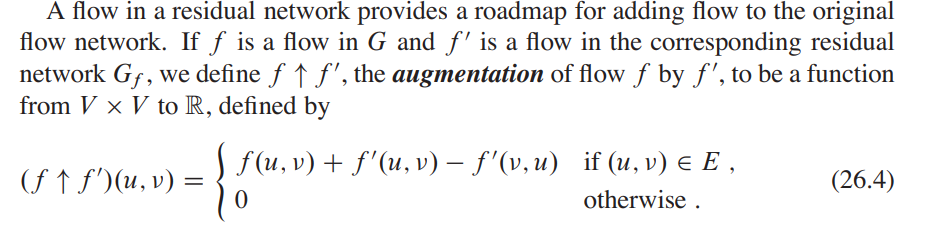{width=75%}

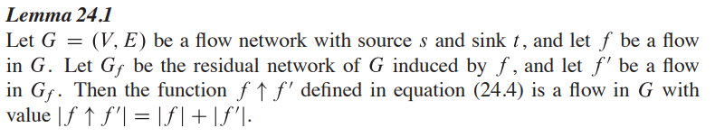{width=75%}

### Aumentando caminos

- **Camino de aumento**: Dado un grafo de flujo $G=(V,E)$ y un flujo $f$, un camino de aumento es un camino de $s$ (source) a $t$ (sink) en el grafo recidual $G_{f}$.
- Llamamos a la máxima cantidad de flujo que podes aumentar en cada arista de un camino de aumento $p$, **capacidad residual** de p: $c_{f} = min\{c_{f}(u,v):(u,v) ∈ p\}$ 
- Podemos definir un flujo en base a la capacidad residual para poder usar el lema 24.1 y aumentar el flujo de $G$. Esto es, 0 si no pertenece al camino de aumento, y si sí pertenece el flujo vale la capacidad residual.
    
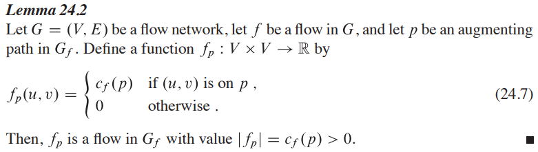{width=75%}

Luego con el lema 24.1, podemos aumentar el flujo de G.

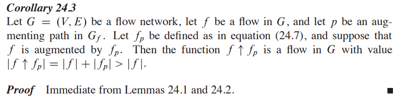{width=75%}

### Cortes en grafo de flujos

- **Corte (S, T)**: Partición de $V$ en $S$ y $T$ (son disjuntos y su unión da V), tal que $s ∈ S$ y $t ∈ T$.
- **Flujo neto del corte**: Si $f$ es el flujo de $G = (V, E)$, entonces el flujo neto del corte se define como:
  
  $\bf{f(S, T) = \sum_{u∈S}\sum_{v∈T} f(u,v) - \sum_{u∈S}\sum_{v∈T} f(v, u)}$. 
  
  (La suma del flujo que va desde S hacia T menos las que van de T hacia S).
- **Capacidad del corte**: $\bf{c(S,T) = \sum_{u∈S}\sum_{v∈T} c(u,v)}$.
- Un **corte mínimo** es aquel cuya capacidad es mínima entre todos los cortes posibles.
  
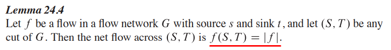{width=75%}

- **Colorario 24.5**: El valor de cualquier flujo $f$ en $G$ está acotado por arriba por la capacidad de cualquier corte. En consecuencia, el valor del máximo flow está acotado por la capacidad del mínimo corte.

- **Teorema Max-flow Min-cut**: Sea $f$ un flujo en el grafo de flujo $G = (V, E)$ con source $s$ y sink $t$, las siguientes condiciones son equivalentes (una implica la otra):
    - $f$ es el flujo máximo de $G$.
    - El grafo residual $G_{f}$ no tiene ningun camino de aumento (de $s$ a $t$).
    - $|f| = c(S,T)$ para algún corte $(S,T)$ de $G$.  

### Algoritmo de Ford-Fulkerson
- Se empieza con un flujo 0 para todas las aristas.
- Se asume que para las aristas que no perteneces al grafo, tanto la capacidad y el flujo son 0 siempre.
- Iterativamente se busca un camino de aumento en el grafo residual y se calcula la capacidad residual del camino encontrado. Luego se actualizan los valores de las aristas tanto en el grafo original como en el residual. Termina cuando ya no hay caminos posibles de $s$ a $t$ en el grafo residual.
- **Complejidad**: $O(m* F)$ ya que en el peor caso en cada iteración se aumenta en 1 el flujo.
  
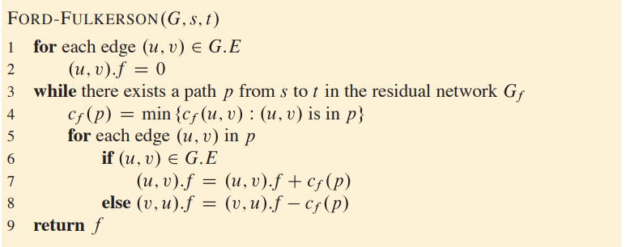{width=75%}

- **Teorema**: Si las capacidades de los arcos de la red son enteras, entonces el problema de flujo máximo tiene un flujo máximo entero.
- Si las capacidades o el flujo inicial son n´umeros irracionales, el método de Ford y Fulkerson puede no parar (es decir, realizar un número infinito de pasos).

### Algoritmo de Edmonds-Karp
Consiste en el método de Ford-Fulkerson en el que se usa BSF para encontrar el camino de aumento. El algoritmo corre en tiempo polinomial y podemos acotarlo sin depender del valor del flujo.

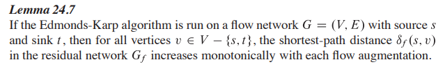{width=75%}

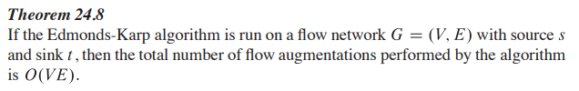{width=75%}

Sigue que como el costo de cada iteración del algoritmo de ford-fulkenson cuesta $O(m)$ y hacemos $O(nm)$ iteraciones, la **complejidad** del algoritmo queda $\bf{O(nm^2)}$

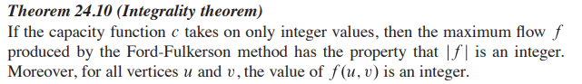{width=75%}

# Complejidad

Definimos un problema como una instancia X y una pregunta Y: *Dado X ¿cumple Y?*.

## Tipos de problema
- Optimización: Elemento entre un conjunto de candidatos que optimiza una función.
- Evaluación: Valor óptimo de una función para un conjunto de candidatos
- Búsqueda: Elemento en un conjunto de candidatos que satisface alguna propiedad.
- Conteo: Cantidad de elementos que satisfacen una propiedad en un conjunto.
- Decisión: Respuesta si o no.

Todos los problemas se pueden reformular como uno de decisión.

## Instancias del problema
Dado un problema de decisión $Π$

- **Instancia positiva**: Aquellas en que la respuesta es Sí.
- **Instancia negativa**: Aquella en que la respuesta es No.
- **Problema complemento**: $Π_{c}$ donde la respuesta a las instancias positivas en $Π$ es No, y las instancias negativas en $Π$ es Sí.

## Certificación y Clases de complejidad
Dado un problema $Π$, un *certificado positivo* de una instancia de $Π$ es una "cadena" que puede ser *verificada* para constatar que efectivametne es una instancia positiva. Equiv para certificado negativo. 

- **P**: Problemas que se pueden resolver en tiempo polinomial
- **NP**: Problemas que tienen un certificado positivo y un verificador de tamaño polinomial.
- **coNP**´: Problemas que tienen un certificado negativo y un verificador de tamaño polinomial.

### Propiedades
- $P ⊆ NP ⟷ P ⊆ coNP$, puedo usar el certificado trivial
- $Π ∈ P ⟷ Π_{c} ∈ P$, hago la negación del programa que resuelve $Π$.
- $Π ∈ NP ⟷ Π_{c} ∈ coNP$, puedo usar el mismo certificado y validador de $Π$ en $Π_{c}$ y viceversa. 

### Reducción
*Reducción / transformación de $Π$ a $Γ$*: consiste en una función $f$ que transforma instancias de $Π$ a instancias de $Γ$ talque se cumple que: **$I$ es una instancia positiva de $Π ⟷ f(I)$ es una instancia positiva de $Γ$**.

Una reducción es polinomial si $f$ es polinomial. Cuando hay una reducción polinomial de $Π$ a $Γ$ se nota $Π ≤_{p} Γ$, y se puede interpretar como $Γ$ es al menos tan dificil cómo $Π$.

### NP-hard y NP-completo
- Un problema $Γ$ es NP-hard si todo problema $Π ∈ NP$ se reduce polinomialmente a $Γ$.
- Si además $Γ ∈ NP$, $Γ$ es NP-completo
- Analogamente se define coNP-hard y coNP-completo
  
Suponiendo $Π ≤_{p} Π'$ se cumple:
- $Π' ∈ P$ entonces $Π ∈ P$
- $Π' ∈ NP$ entonces $Π ∈ NP$ (certifico $Π$ con la transformación)
- $Π' ∈ coNP$ entonces $Π ∈ coNP$
- $Π ∈ NPC$ entonces $Π' ∈ NP-hard$
- $Π ∈ NPC ∧ Π' ∈ NP$ entonces $Π' ∈ NPC$


# Notas para el parcial

## Camino mínimo
Planteado un modelo de camino mínimo se debe mostrar la conexión modelo-problema:

*Existe un recorrido valido en el problema de A a B que cumple las restricciónes, con distancia/costo C $⟷$ Existe un camino en el grafo de A a B que pasa por ciertas aristas y el costo es C.*

De cierta forma para la demostración de la ida hay que "matchear" las componentes del recorrido con las aristas del camino en el grafo. Justificando que las aristas en el modelo existen, se hace un recorrido válido y el costo se cumple.
Para la vuelta algo parecido, dado el camino válido en el grafo tengo que poder armar una instancia válida del problema que tenga el costo C y use las aristas del modelo. Justificar también que el camino que se arma es valido y que se cumple el costo.

Luego de probar el sii sabemos que si tenemos un camino mínimo en el problema, podemos armar un camino óptimo en el problema. Y viceversa.

## SDR
Tenemos un conjunto de variables $x_{1}...x_{n}$ y se quiere decidir si existe una asignación para  cada una talque se cumpla las restricciones de la forma $x_{i} - x_{j} ≤ c_{ij}$

Se puede armar el siguiente digrafo D:

- $v_{j} → v_{i}$ con peso $c_{ij}$ por cada ecuación $x_{i} − x_{j} ≤ c_{ij}$
- $v_{0} → v_{i}$ con peso 0 por cada $1 ≤ i ≤ n$

- Si el digrafo D tiene un ciclo de peso negativo, entonces el sistema no tiene solución.
- Caso contrario, $x_{i} = d(v_{0}, v_{i})$ es una asignación que satisface todas las ecuaciones.

Se puede resolver el sistema con Bellman ford, costo $\bf{O(nm)}$

### Propiedades
- Si todos los $c_{ij}$ son enteros, la solución es entera.
- Si todos los $c_{ij}$ son pares, la solución es par. (no podemos afirmar lo mismo con impar).
- Se puede modelar $x_{i} - x_{j} = c_{ij}$ con ambas desigualdades $x_{i} - x_{j} ≤ c_{ij}$ y $x_{j} - x_{i} ≤ c_{ij}$
- $x_{i} - x_{j} < c_{ij}$ con $x_{i} - x_{j} ≤ c_{ij} - 1$
- $x_{i} ≥ n$ con n un numero cualquiera. Se puede modelar con $x_{i} - z ≥ n$ y agregamos un nodo adicional (que represente z) al modelo. 
- Podemos sumar una constante D a todos las asignaciones y se sigue cumpliendo las inecuaciones:

$x_{i} - x_{j} ≤ c_{ij} ≡ x_{i} - x_{j} + D - D  ≤ c_{ij} ≡ (x_{i}+ D) - (x_{j} + D) ≤ c_{ij}$

### Pasos para resolver un ejercicio de SDR
Modelar el problema planteando todas las inecuaciones correspondientes a las restricciones del problema y justificar. Para esto tengo que mostrar que se cumple:

*Las condiciones se satisfacen $⟷$ Existe una asignación válida para el problema*

Para la ida basicamente tomo la solución que me da el modelo y armo la solución del problema y justifico que se cumple todas las restricciones del problema. 

Recordar que si hacemos el truco de $x_{i} - z ≥ n$ los $x_{i}$ pueden ser negativos. Por lo que la asignación podría ser "x_{i} - z" para el problema y sigue cumpliendo las restricciones por lo visto anteriormente.

Para la vuelta hay que tomar la solución del problema y ver que se cumplen todas las inecuaciones que definen al grafo.

Luego resta proponer un algoritmo y justificar la complejidad.

## Flujo
Luego de plantear el modelo se debe probar que 

*Existe un flujo factible de flujo F para el grafo  $⟷$ El problema tiene una solución de cantidad relacionada con F*

Para la ida tenemos que probar que con el flujo F se puede armar una solución al problema que respete todas las restricciones y sea de "tamaño" (el significado depende el problema) F.

Para la vuelta tenemos que tomar los datos del problema con sus restricciones e ir armando el flujo. Se tiene que justificar que se respeta las restricciones de capacidad y conservación, y luego que efectivamente se obvtiene un flujo de valor F.

Entonces para problemas de maximización, cuando tengamos un flujo máximo, tendremos una solución óptima.
